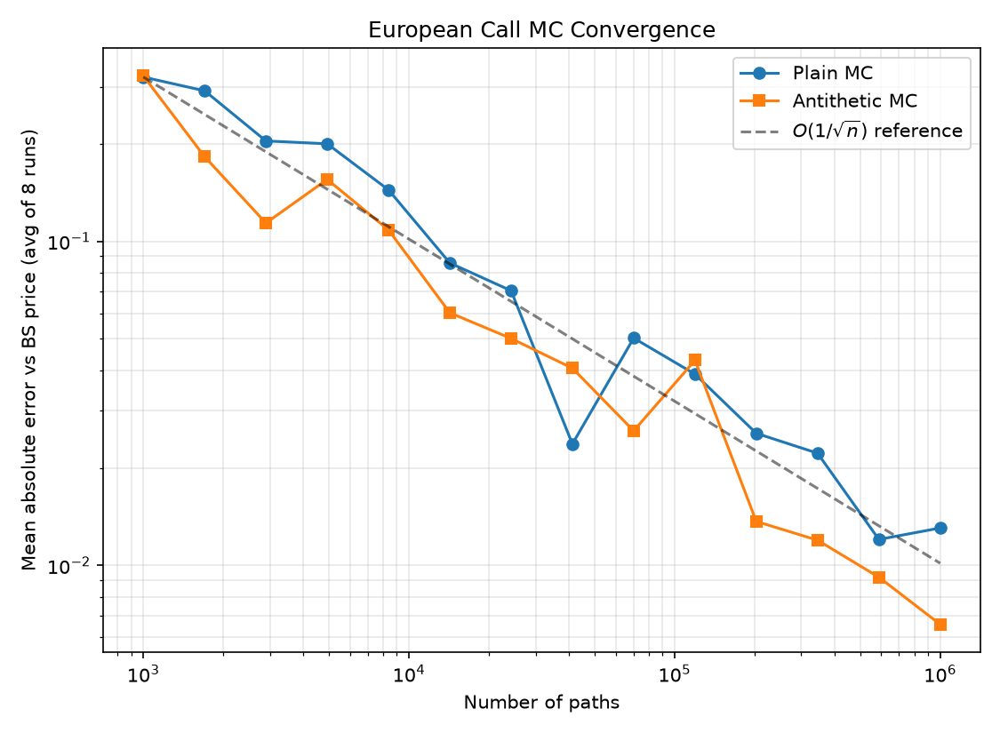

# mc-pricer

Monte Carlo exotic option pricer built on a vectorized NumPy GBM path
simulator, with a Numba `@njit` variant, variance reduction (antithetic
variates, control variates), and finite-difference Greeks with common
random numbers (CRN).

## Files

- `mc_pricer.py` — core library: Black-Scholes closed form, NumPy/Numba GBM
  simulators, European/Asian/barrier payoffs, MC pricing + variance
  reduction helpers.
- `run_analysis.py` — runs everything, prints the results table, benchmarks
  NumPy vs Numba, computes Greeks, and saves `convergence.png` /
  `results_table.md`.
- `test_pricer.py` — pytest suite (BS validation, variance-reduction sanity
  checks, NumPy/Numba agreement).
- `requirements.txt`

## Model

Exact (non-Euler) GBM path simulation: each step draws
`log S_{t+dt} = log S_t + (r - 0.5*sigma^2)*dt + sigma*sqrt(dt)*Z`, so there
is no discretization bias — increments are simulated from their exact
lognormal distribution regardless of step count.

Base parameters used below: `S0=100, K=100, r=5%, sigma=20%, T=1y`,
`252` monitoring steps, `200,000` paths, barrier `B=120` (up-and-out),
seed `42`.

## Results (actual measured run)

Black-Scholes reference price: **10.450584**

| Option | Price | Std Error | Error vs BS | Variance Reduction |
|---|---|---|---|---|
| European (plain) | 10.504703 | 0.033110 | 0.054119 | -- |
| European (antithetic) | 10.460014 | 0.023399 | 0.009431 | 50.1% |
| Asian (plain) | 5.804757 | 0.017935 | n/a | -- |
| Asian (control variate) | 5.780086 | 0.009687 | n/a | 70.8% |
| Barrier (plain) | 1.318460 | 0.007575 | n/a | -- |
| Barrier (antithetic) | 1.316179 | 0.007097 | n/a | 12.2% |

"Variance Reduction" is `1 - (se_reduced / se_plain)^2`, i.e. the percentage
drop in *variance* (not standard error) versus plain MC at the same path
count. The Asian control variate (using the European MC price, from the
same paths, as the control, with the exact BS price as its known mean) gets
the biggest win since Asian and European payoffs on the same path are
highly correlated. Antithetic variates roughly halve European call variance
(as expected — the payoff is close to linear near the money) but only give
a modest ~12% reduction for the barrier option, since knock-out is a
discontinuous, highly path-dependent event that antithetic pairing doesn't
correlate as well.

### Simulator benchmark: vectorized NumPy vs Numba njit

500,000 paths x 252 steps, best of 5 runs, outputs verified identical to
1e-8:

| Simulator | Time (ms) |
|---|---|
| NumPy (vectorized) | 6155.8 |
| Numba (njit, parallel) | 2218.2 |

**Speedup: 2.78x**

### Greeks: finite differences with common random numbers

Central differences (`h_S=1.0`, `h_sigma=0.01`) using the *same* underlying
random draws (antithetic pairs) for every bumped/unbumped simulation, so
the only thing that changes between prices is the bump itself:

| Option | Delta | Vega | BS Delta | BS Vega |
|---|---|---|---|---|
| European | 0.637140 | 37.588867 | 0.636831 | 37.524035 |
| Asian | 0.588598 | 21.821929 | n/a | n/a |
| Barrier | -0.019950 | -13.531247 | n/a | n/a |

The European FD Greeks match the analytic Black-Scholes values to ~3e-4
(delta) and ~0.06 (vega) with only 200k CRN paths — CRN is what makes this
precision possible; independent draws per bump would need far more paths
to beat the finite-difference noise floor. The barrier delta/vega are
small/negative near this barrier level because pushing `S0` up both
increases the in-the-money payoff *and* increases the knock-out
probability, and the latter effect dominates here.

### Convergence

Absolute error vs the Black-Scholes price for the European call, averaged
over 8 independent repeats per path count, plain MC vs antithetic MC:



Both curves track the theoretical `O(1/sqrt(n))` rate; the antithetic curve
sits consistently at or below the plain curve for the same path count.

## Running it

```bash
pip install -r requirements.txt
python run_analysis.py   # prints the table, saves convergence.png + results_table.md
pytest -v                # 7 tests: BS validation, variance reduction, NumPy/Numba agreement
```

## Notes on the numba speedup

2.78x on this machine is a modest but real speedup from a naive `prange`
loop over paths — most of the win in the pure-NumPy version already comes
from vectorization, so the njit version isn't a 10-100x jump here (that
tends to show up more when the inner loop has data dependencies that don't
vectorize as cleanly, e.g. path-dependent barrier monitoring done
incrementally, or when running on a machine with many more cores for
`prange` to use).
